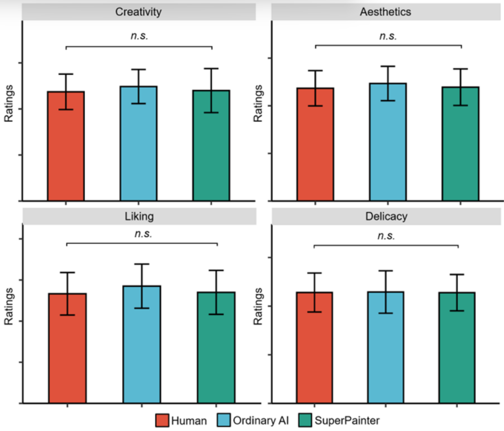
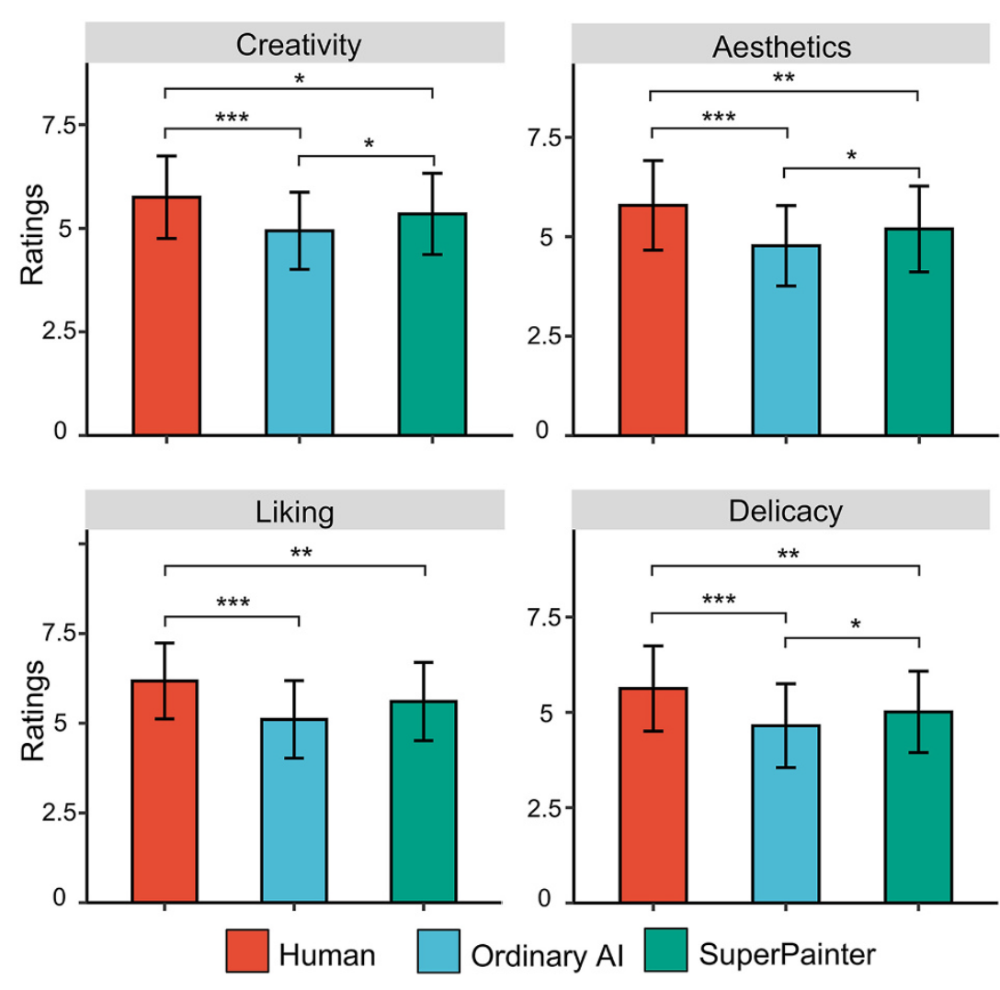

```{r}
#| include: false
#| echo: false
#| warning: false
#| message: false

library(tidyverse)
library(ggpubr)
library(knitr)
library(kableExtra)
```

# Introduction

Generative AI has exploded in popularity in the most recent years with the onset of popular LLM's such as Deepseek, ChatGPT, and Claude. As new technologies are incorporated such as Generative Adversarial Networks (GANs), it becomes harder to distinguish between human and AI generated artwork, highlighting the ethical importance of disclaiming the use of AI in our published works. However, a more pressing concern of using generative AI tools is a loss of integrity often associated with the lack of perceived effort required to generate such works. 
Ragot [@ragot_ai-generated_2020] in the first large sample test of its kind, found that real artworks made by humans were evaluated more highly than real AI-generated artworks, regardless of what initially primed author (human or AI) it was labeled. Findings by Google [rae_effects_2024] showed a perceived bias against content generated by AI in terms of satisfaction and qualification in a mixed batch of content pertaining to news, travel, health, and jokes. In the domain of art, much of what is considered to be "good" art is considered subjective. This ambiguity in how well an art piece performs opens a rift in the realm of artwork. Those who support the use of AI in creative output cite the ease of access to those who are not well versed in the work and scalability of bringing features through production. Those who are not in support of AI claim ethics violations over the ownership of the AI-generated intellectual property. Given the polarized discourse surrounding the use of these tools, determining a consensus among the general population remains a challenge.
We wish to answer the question: Is there an evaluative bias towards AI-generated art? How do the influences of perceived effort, perceived threat, and emotional engagement contribute to this bias? A paper by Zhang et al. [zhang_will_2026] attempts to quantify these effects, citing consistent evaluated bias against AI-generated artworks, due to correlations in perceived effort (Study 2), existential threats (Study 3), and a lack of emotional connections to AI-labeled paintings (Study 4). In Section 1, we discuss supplemental literature regarding the perception of AI in various fields of content generation. Then in section 2, we describe the main article's study design. Section 3 introduces the statistical plan and power analysis, Section 4 contains the reanalysis of the study, and lastly, Section 5 discusses the implications of our findings.

# Literature Review

## The Effects of Perceived AI Use on Content Perceptions

Rae, Google [rae_effects_2024] found 550 participants from an anonymous Cint panel and obtained 2200 Qualtrics generated responses in a 3 (human, human-ai assisted, and ai generated content) by 4 (news, travel, health, and jokes) mixed design experiment and measured perceptions of originality, trustworthiness, presentation, satisfaction, perceived effort, and likelihood to share. Ratings were on a 1 (not at all qualified) to 5 (extremely qualified) unipolar Likert scale. An additional question asked participants to explain their reasoning to explore beliefs and attitudes driving the survey behaviors. A one-way Analysis of Covariance (ANCOVA) was performed to test for the effects of assigned creator and context, with a Dunn-Šídák correction for post-hoc analysis.
These surveys are gathered from a wider area outside of art (news, travel, health, and jokes) and are similar to what the focus of what the main study aimed to quantify. For example, originality, trustworthiness, presentation, satisfaction, and perceived effort are similar to the main article's measures of creativity, profundity, and aesthetics. The quantitative results align with the focus of our main study: a bias towards human generated content was identified in the evaluation capacities of satisfaction, qualification, and effort, but no differences in the judgement of the content generated were found. These findings form a basis for how AI is discerned in the population under general topics, which the main article builds upon by pinpointing similar opinions for artworks. The most similar subject area to art was "Jokes" in the google study, chosen due to its highly subjective nature, a common denominator between art and comedy.
Quantitative results show a significant main effect of the assigned creator on how satisfied participants judged content to be, which is most comparable to Study 1's dimensions of "Liking" and "Aesthetics" as well as their respective results. Participants felt creators were less qualified when the assigned creator mentioned AI use than when it was created by a human. This marker is not as important in art and design as it does in other fields, so it was not a consideration for the comparison of artwork. It was found that participants believed significantly less effort was put into content when the creator was AI or AI-assisted than when the creator was human, which echoes the results of Study 2. The main article explains one step further and attempts to quantify how the change in perceived effort affects bias on other dimensions. 


## AI-generated vs. Human Artworks. A Perception Bias Towards Artificial Intelligence?

In a publication presented during the Computer Human Interaction (CHI) conference in 2020, the authors of the study, “AI-generated vs. Human Artworks. A Perception Bias Towards Artificial Intelligence?”, presented an experiment where 565 participants evaluated paintings from both humans and AI on the following criteria: declared liking, perceived beauty, novelty, and meaning. Participants were recruited from Amazon Mechanical Turk (AMT) and rated impression-style paintings of portraits and landscapes of both human and AI origins. Ratings were on a 1 (totally disagree) to 7 (totally agree) scale. At the end of the study, there was a modified Turing test to circumvent a priming effect (participants were initially informed the declared author type: AI or human) and potential evaluation bias; this procedure involved telling participants that the identity of the painter had been manipulated and asking them to guess the origin of 4 paintings (each pairing of human/AI and landscape/portrait). 
For the analysis, the authors fitted a mixed model with the participant and painting as random effects while the induction condition was considered a between-subject factor; separate models were created for each evaluation dimension. The paper discovered that the main effect of induction (setting up mental expectations by revealing the “author”) and type of painting were significant for all evaluation criteria. Likewise, effects of the true author were also significant except for “perceived novelty.” The easiest paintings for participants to distinguish were human-made paintings and portraits. In our main study of interest, there is not a distinction between the type of paintings; however, there is an adjacent question of how introducing the author of a painting may influence its evaluation. This induction effect echoes the evaluative bias that our paper highlights.

# Study Design

The main paper aims to investigate the underlying factors of the negative bias against generative AI, specifically AI-generated artwork. They hypothesize that those who have a negative attitude towards generative AI, feel that AI-generated works take less effort, feel a loss of sense of control, or feel like AI-generated work lacks emotion will have a negative bias against AI-generated artwork. The authors conduct five studies in order to test these hypotheses, but we will only focus on the first two studies.

## Study 1
The purpose of Study 1 is to confirm that a bias exists towards AI-labeled artwork. This is the only study not pre-registered. Sixty participants were recruited from university social media groups. Participants were required to rate items on a 5-point scale where 1 represented totally disagree and 5 represented totally agree. These items were meant to measure their attitudes towards AI across cognition, behavior, and affect. After a within-subject design was implemented where participants were required to rate 80 paintings (generated by the researchers) across the dimensions creativity, aesthetics, degree of liking, and degree of delicacy. They rated it on a scale of 1-9 where 1 represented “dislike very much” and 9 represented “like very much”. These 80 paintings were randomly divided into two graphs with two labels. 40 of the trials assigned the label “Created by AI” to the paintings, and the other 40 assigned the label “Created by Human”. The order of presentation was randomized.

To evaluate the data, they conducted four separate t-tests on the four dimensions with the label as the independent variable. They found that the participants viewed paintings labeled “Created by human” in a more positive light compared to those with the label “Created by AI”. Additionally, to check for any differences in evaluations from the labels rather than the paintings, they conducted corresponding analyses which showed no significant differences in all dimensions. 

They create a Bias index for each participant by subtracting the mean ratings given by each participant all paintings labeled “Created by AI” from that of all paintings labeled “Created by human”: Bias = $\frac{1}{n} \sum_1^n R_{human} - \frac{1}{n} \sum_1^n R_{AI}$. The larger the value is, the greater the bias of the participants against AI labeled pieces. Then, they performed linear regression analyses to predict the bias in each dimension with participants’ attitude towards AI as the predictor. They found that as the attitude towards AI becomes more positive, the bias towards AI in all dimensions will decrease.

## Study 2
The purpose of Study 2 was to investigate how perceived effort impacts bias toward AI-labeled artworks. They again recruited 60 participants through university social media groups. Their power analysis showed that this sample size would provide 80% power to detect an effect of f=0.17 with $\alpha$=0.05.

This study used a within-subject design. Like Study 1, they were required to rate 78 paintings in a randomized order across the same four dimensions. What differs is that participants were told before they rated the paintings that some of them were generated by a model, SuperPainter, that spends 30 to 40 minutes on each painting. They also had the chance to test the tool. Out of the 78 paintings, 26 were labeled “human artist”, 26 “ordinary AI”, and the last 26 “SuperPainter”. After rating the paintings, participants were also required to assess how much effort they believed the creators put into the paintings.

A Friedman test was conducted on the perceived effort check which revealed a main effect. This means that participants believed that humans invested the most effort when painting, then SuperPainter, and lastly ordinary AI. A series of ANOVA tests were conducted on the perceived effort check and the four dimensions. They found that paintings labeled as “Created by human” had the highest rating across all dimensions. While “Created by Superpainter” has higher ratings than “Created by ordinary AI”, there was no significant difference in preference.

# Statistical Analysis Plan and Power Analysis
## Study 1


## Study 2
The dataset we used came from the real data collected by the researchers. The observational unit is a single participant. The relevant variables are the creativity, aesthetic, liking, and refinement ratings for each painting and the ranking of effort of human, ordinary AI, and Superpainter. The data was collected by requiring each of the 60 participants to rate the 78 paintings along the four dimensions. Then, they had to rank how much effort humans, ordinary AI, and Superpainter put into their paintings, which is referred to as the manipulation check.

This study is a repeated measures within-subject design with three conditions: human, ordinary AI, and Superpainter. They conduct a Friedman test on the manipulation check. A Friedman test is a non-parametric repeated measures ANOVA approach to ranking statistics. This was used to check if there is a statistical difference between the medians of the participants' perceived effort rankings of human, ordinary AI, and Superpainter AI. Next, they perform a series of ANOVAs on the four main dimensions. To account for the correlation between responses from a single subject that comes from repeated measures, they collapse the observations into the mean. This was performed in order to determine whether a difference between human, ordinary AI, and Superpainter exists across the dimensions.

# Reanalysis
## Study 1

```{r}
#| echo: false
study2<- read.csv("data/Study2_Cleaned.csv")
```


## Study 2
### Friedman's Test
```{r}
#| echo: false
#| include: false
colnames(study2)[319] <- "superpainter"
colnames(study2)[318] <- "ai"
colnames(study2)[317] <- "human"
colnames(study2)[2] <- "id"

study2_p1 <- data.frame(study2$human,study2$ai,study2$superpainter)
study2_p1 <- data.matrix(study2_p1)
friedman.test(study2_p1)

#Effect size W
79.633/(60*(3-1))
```
```{r}
#| echo: false
#| include: false
# Data Wrangling
df <-study2 %>%
  pivot_longer(
    cols=contains("_"),
    names_to = c("painting",".value"),
    names_sep = "_"
  ) %>%
  mutate(painting = str_remove_all(painting, "X")) %>%
  mutate(painting = as.integer(painting)) %>%
  mutate(block = case_when(
    painting <= 29 ~ 1L,
    painting <= 55 ~ 2L,
    painting <= 81 ~ 3L
  )) %>%
  mutate(condition = case_when(
    block == 1 ~ "human",
    block == 2 ~ "ai",
    block == 3 ~ "superpainter"
  ))


participant_means <- df %>%
  group_by(id, condition) %>%
  summarise(
    creativity = mean(creativity, na.rm = TRUE),
    aesthetic  = mean(aesthetic,  na.rm = TRUE),
    liking     = mean(liking,     na.rm = TRUE),
    refinement = mean(refinement, na.rm = TRUE),
    .groups = "drop"
  ) %>%
  mutate(
    id        = as.factor(id),
    condition = as.factor(condition)
  )


# generate plots

plot_data <- participant_means %>%
  pivot_longer(cols=c(creativity,aesthetic,liking,refinement)) %>%
  group_by(condition,name) %>%
  summarize(N=length(value),Ratings=round(mean(value),2), sd=round(sd(value),2))
  

```

### Plot Comparison
```{r fig-study2f1}
#| echo: false
ggplot(plot_data, aes(x=condition,y=Ratings, fill=condition))+
  facet_wrap((~name)) +
  theme_minimal(base_size=13) +
  scale_fill_manual(values=c(
    "human" = "orangered3",
    "ai" = "steelblue2",
    "superpainter" = "mediumseagreen"
  ))+
  geom_col(width=.5,color="black")+
  geom_errorbar(aes(ymin=Ratings-sd,ymax=Ratings+sd),width=.15)
```
```{r figoriginalS5}
#| echo: false

```
```{r figoriginal2}
#| echo: false

```

### Summary Table
```{r fig-summarytable}
#| echo: false
kable(plot_data) %>%
  collapse_rows(columns=1:2)

```
### ANOVA on aggregated results, repeated measures within condition
``` {r fig-ANOVAresults}
#| echo: false
# Repeated measures within condition

#creativity
r1=summary(aov(creativity~condition + Error(id/condition),data=participant_means))
#aesthetic
r2=summary(aov(aesthetic~condition + Error(id/condition),data=participant_means))
#liking
r3=summary(aov(liking~condition + Error(id/condition),data=participant_means))
#refinement
r4=summary(aov(refinement~condition + Error(id/condition),data=participant_means))

results=data.frame(rating=c("Creativity", "Aesthetic", "Liking", "Refinement"))
results=cbind(results,rbind(r1$`Error: id:condition`[[1]][1,][4:5],r2$`Error: id:condition`[[1]][1,][4:5],r3$`Error: id:condition`[[1]][1,][4:5],r4$`Error: id:condition`[[1]][1,][4:5]))

rownames(results) <- NULL
results[2:3]=apply(results[2:3],1:2, round, digits=2)
kable(results)
```
### Software
We implement the reanalysis using R [@r_language]. Power analyses done with GPOWER [@GPOWER]. Plots done with ggpubr
[@ggpubr]. Data manipulation done with [@tidyverse]. Tables done with [@knitr].

# Discussion
## Strengths and Weaknesses
## Limitations
## Future Works
# References