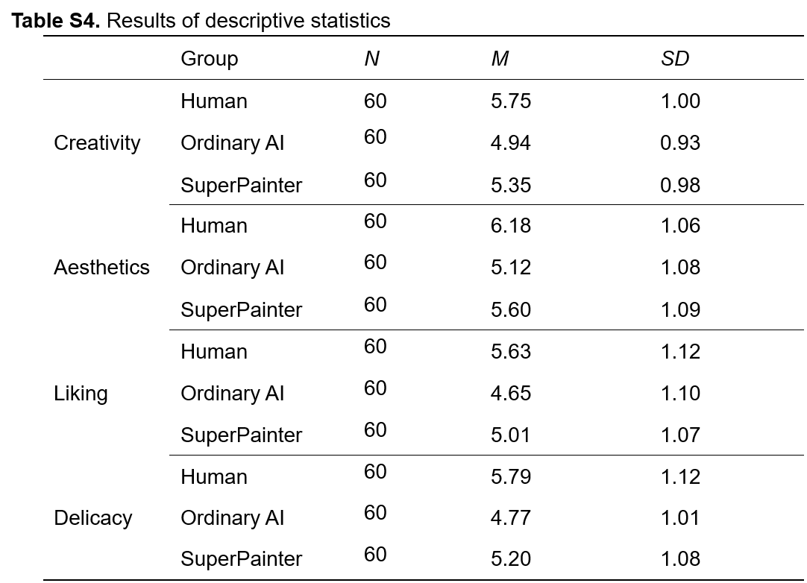

```{r}
#| include: false
#| echo: false
#| warning: false
#| message: false

library(tidyverse)
library(ggpubr)
library(knitr)
library(kableExtra)

library(ggplot2)
library(tidyr)
library(forcats)
library(patchwork)
library(pwr)
library(readxl)
library(dplyr)
```

# Introduction

Generative AI has exploded in popularity in the most recent years with the onset of popular LLM's such as Deepseek, ChatGPT, and Claude. As new technologies are incorporated such as Generative Adversarial Networks (GANs), it becomes harder to distinguish between human and AI generated artwork, highlighting the ethical importance of disclaiming the use of AI in our published works. However, a more pressing concern of using generative AI tools is a loss of integrity often associated with the lack of perceived effort required to generate such works. 
Ragot [@ragot_ai-generated_2020] in the first large sample test of its kind, found that real artworks made by humans were evaluated more highly than real AI-generated artworks, regardless of what initially primed author (human or AI) it was labeled. Findings by Google [@rae_effects_2024] showed a perceived bias against content generated by AI in terms of satisfaction and qualification in a mixed batch of content pertaining to news, travel, health, and jokes. In the domain of art, much of what is considered to be "good" art is considered subjective. This ambiguity in how well an art piece performs opens a rift in the realm of artwork. Those who support the use of AI in creative output cite the ease of access to those who are not well versed in the work and scalability of bringing features through production. Those who are not in support of AI claim ethics violations over the ownership of the AI-generated intellectual property. Given the polarized discourse surrounding the use of these tools, determining a consensus among the general population remains a challenge.
We wish to answer the question: Is there an evaluative bias towards AI-generated art? How do the influences of perceived effort, perceived threat, and emotional engagement contribute to this bias? A paper by Zhang et al. [@zhang_will_2026] attempts to quantify these effects, citing consistent evaluated bias against AI-generated artworks, due to correlations in perceived effort (Study 2), existential threats (Study 3), and a lack of emotional connections to AI-labeled paintings (Study 4). In @sec-litreview, we discuss supplemental literature regarding the perception of AI in various fields of content generation. Then in @sec-studydesign, we describe the main article's study design. @sec-power introduces the statistical plan and power analysis, @sec-reanalysis contains the reanalysis of the study, and lastly, @sec-discussion discusses the implications of our findings.

# Literature Review {#sec-litreview}

## The Effects of Perceived AI Use on Content Perceptions

Rae (Google) [@rae_effects_2024] found 550 participants from an anonymous Cint panel and obtained 2200 Qualtrics generated responses in a 3 (human, human-ai assisted, and ai generated content) by 4 (news, travel, health, and jokes) mixed design experiment and measured perceptions of originality, trustworthiness, presentation, satisfaction, perceived effort, and likelihood to share. Ratings were on a 1 (not at all qualified) to 5 (extremely qualified) unipolar Likert scale. An additional question asked participants to explain their reasoning to explore beliefs and attitudes driving the survey behaviors. A one-way Analysis of Covariance (ANCOVA) was performed to test for the effects of assigned creator and context, with a Dunn-Šídák correction for post-hoc analysis.
These surveys are gathered from a wider area outside of art (news, travel, health, and jokes) and are similar to what the focus of what the main study aimed to quantify. For example, originality, trustworthiness, presentation, satisfaction, and perceived effort are similar to the main article's measures of creativity, profundity, and aesthetics. The quantitative results align with the focus of our main study: a bias towards human generated content was identified in the evaluation capacities of satisfaction, qualification, and effort, but no differences in the judgement of the content generated were found. These findings form a basis for how AI is discerned in the population under general topics, which the main article builds upon by pinpointing similar opinions for artworks. The most similar subject area to art was "Jokes" in the google study, chosen due to its highly subjective nature, a common denominator between art and comedy.
Quantitative results show a significant main effect of the assigned creator on how satisfied participants judged content to be, which is most comparable to Study 1's dimensions of "Liking" and "Aesthetics" as well as their respective results. Participants felt creators were less qualified when the assigned creator mentioned AI use than when it was created by a human. This marker is not as important in art and design as it does in other fields, so it was not a consideration for the comparison of artwork. It was found that participants believed significantly less effort was put into content when the creator was AI or AI-assisted than when the creator was human, which echoes the results of Study 2. The main article explains one step further and attempts to quantify how the change in perceived effort affects bias on other dimensions. 


## AI-generated vs. Human Artworks. A Perception Bias Towards Artificial Intelligence?

In a publication presented during the Computer Human Interaction (CHI) conference in 2020 [@ragot_ai-generated_2020], the authors of the study, “AI-generated vs. Human Artworks. A Perception Bias Towards Artificial Intelligence?”, presented an experiment where 565 participants evaluated paintings from both humans and AI on the following criteria: declared liking, perceived beauty, novelty, and meaning. Participants were recruited from Amazon Mechanical Turk (AMT) and rated impression-style paintings of portraits and landscapes of both human and AI origins. Ratings were on a 1 (totally disagree) to 7 (totally agree) scale. At the end of the study, there was a modified Turing test to circumvent a priming effect (participants were initially informed the declared author type: AI or human) and potential evaluation bias; this procedure involved telling participants that the identity of the painter had been manipulated and asking them to guess the origin of 4 paintings (each pairing of human/AI and landscape/portrait). 
For the analysis, the authors fitted a mixed model with the participant and painting as random effects while the induction condition was considered a between-subject factor; separate models were created for each evaluation dimension. The paper discovered that the main effect of induction (setting up mental expectations by revealing the “author”) and type of painting were significant for all evaluation criteria. Likewise, effects of the true author were also significant except for “perceived novelty.” The easiest paintings for participants to distinguish were human-made paintings and portraits. In our main study of interest, there is not a distinction between the type of paintings; however, there is an adjacent question of how introducing the author of a painting may influence its evaluation. This induction effect echoes the evaluative bias that our paper highlights.

# Study Design {#sec-studydesign}

The main paper aims to investigate the underlying factors of the negative bias against generative AI, specifically AI-generated artwork. They hypothesize that those who have a negative attitude towards generative AI, feel that AI-generated works take less effort, feel a loss of sense of control, or feel like AI-generated work lacks emotion will have a negative bias against AI-generated artwork. The authors conduct five studies in order to test these hypotheses, but we will only focus on the first two studies.

## Study 1
The purpose of Study 1 is to confirm that a bias exists towards AI-labeled artwork. This is the only study not pre-registered. Sixty participants were recruited from university social media groups. Participants were required to rate items on a 5-point scale where 1 represented totally disagree and 5 represented totally agree. These items were meant to measure their attitudes towards AI across cognition, behavior, and affect. After a within-subject design was implemented where participants were required to rate 80 paintings (generated by the researchers) across the dimensions creativity, aesthetics, degree of liking, and degree of delicacy. We believe “refinement” is a more accurate translation of the metric intended for "delicacy,” so we will substitute this term when referring to this measure. They rated it on a scale of 1-9 where 1 represented “dislike very much” and 9 represented “like very much”. These 80 paintings were randomly divided into two graphs with two labels. 40 of the trials assigned the label “Created by AI” to the paintings, and the other 40 assigned the label “Created by Human”. The order of presentation was randomized.

To evaluate the data, they conducted four separate t-tests on the four dimensions with the label as the independent variable. They found that the participants viewed paintings labeled “Created by human” in a more positive light compared to those with the label “Created by AI”. Additionally, to check for any differences in evaluations from the labels rather than the paintings, they conducted corresponding analyses which showed no significant differences in all dimensions. 

They create a Bias index for each participant by subtracting the mean ratings given by each participant all paintings labeled “Created by AI” from that of all paintings labeled “Created by human”: Bias = $\frac{1}{n} \sum_1^n R_{human} - \frac{1}{n} \sum_1^n R_{AI}$. The larger the value is, the greater the bias of the participants against AI labeled pieces. Then, they performed linear regression analyses to predict the bias in each dimension with participants’ attitude towards AI as the predictor. They found that as the attitude towards AI becomes more positive, the bias towards AI in all dimensions will decrease.


## Study 2
The purpose of Study 2 was to investigate how perceived effort impacts bias toward AI-labeled artworks. They again recruited 60 participants through university social media groups. Their power analysis showed that this sample size would provide 80% power to detect an effect of f=0.17 with $\alpha$=0.05.

This study used a within-subject design. Like Study 1, they were required to rate 78 paintings in a randomized order across the same four dimensions. What differs is that participants were told before they rated the paintings that some of them were generated by a model, SuperPainter, that spends 30 to 40 minutes on each painting. They also had the chance to test the tool. Out of the 78 paintings, 26 were labeled “human artist”, 26 “ordinary AI”, and the last 26 “SuperPainter”. After rating the paintings, participants were also required to assess how much effort they believed the creators put into the paintings.

A Friedman test was conducted on the perceived effort check which revealed a main effect. This means that participants believed that humans invested the most effort when painting, then SuperPainter, and lastly ordinary AI. A series of ANOVA tests were conducted on the perceived effort check and the four dimensions. They found that paintings labeled as “Created by human” had the highest rating across all dimensions. While “Created by Superpainter” has higher ratings than “Created by ordinary AI”, there was no significant difference in preference.

### Strengths and Weaknesses
The researchers randomized when possible which can help with confounding. In particular, they randomized the order that paintings were presented in for both studies. Additionally, they utilize a within-subjects design which helps with individual-level confounders such as someone rating all of the paintings highly or all of the paintings poorly. The robustness check with unlabeled pilot data is also a good way to ensure that any differences found were due to the labels and not the paintings themselves.

These studies both recruit participants from universities, so the mean age is in the early 20s, and it is female dominated. Additionally, they contain only one ethnic group. This is not very representative of the population, and they should have created a more diverse group at least across ages. The studies also use G*Power to conduct the power analysis in Study 2. While not an incorrect software to use, they do not justify their choice of using the default options for the nonsphericity correction and correlation among repeated experiments. They also don’t mention which previous research justified the sample size. 

Another weakness lies in their independent testing of each evaluation dimension in Study 1. This does not allow the authors to account for the potential, reasonable correlation between dimensions. Multiple linear regression would be more appropriate for this dataset. The authors also omit random effect terms for participants and painting. This would help us account for natural variations in a participant’s art affinity/technology savviness as well as individual painting quality inconsistency. The paper uses pilot study data to claim equal quality of paintings across declared author groups; however, this considers the average quality, not specific differences. 


# Statistical Analysis Plan and Power Analysis {#sec-power}
## Study 1
The dataset consisted of real data collected by the researchers. The observational unit is a single participant. The participants were all of Chinese ethnicity with a mean age of less than 21 years old and had normal color vision. They were rewarded with CNY 20 for participating.
The relevant variables were attitude towards AI, creativity (how creative they thought the painting was), aesthetic (how much aesthetic value they thought the painting could bring), degree of liking (how much they liked the painting), and degree of delicacy (how refined they thought the painting was). Attitude towards AI was measured using a 5-point scale (1 = totally disagree to 5 = totally agree). The four dimensions were evaluated on a 9-point scale (1 = dislike very much to 9 = like very much).

This study is a repeated measures within-subject design. They first conduct four separate t-tests using the label as the independent variable. Each test was performed on a different dimension. Then, they create a bias index used for the set of regressions analyses performed. This bias index was the average difference in evaluation ratings for paintings labeled human versus AI creators. These four simple linear regression analyses were performed to predict the bias in each dimension with participants’ attitude towards AI as the predictor. An improvement to this protocol would be to use multiple linear regression. 


## Study 2
The dataset we used came from the real data collected by the researchers. The observational unit is a single participant. The participants were, again, all of Chinese ethnicity with a mean age of around 22 years old and majority female. The relevant variables are the creativity, aesthetic, liking, and refinement ratings for each painting and the ranking of effort of human, ordinary AI, and Superpainter. The data was collected by requiring each of the 60 participants to rate the 78 paintings along the four dimensions. Then, they had to rank how much effort humans, ordinary AI, and Superpainter put into their paintings, which is referred to as the manipulation check.

This study is a repeated measures within-subject design with three conditions: human, ordinary AI, and Superpainter. They conduct a Friedman test on the manipulation check. A Friedman test is a non-parametric repeated measures ANOVA approach to ranking statistics. This was used to check if there is a statistical difference between the participants' perceived effort rankings of human, ordinary AI, and Superpainter AI. The null and alternative hypotheses are 
$H_0$: There is no significant difference between the rankings of perceived effort between the human, AI, and superpainter paintings.
$H_a$: There is at least one significantly different ranking result of perceived effort than the others.
The Friedman test statistic is calculated as follows: $$\chi^2=\frac{12}{nK(K+1}\sum R^2_j-3n(K+1)$$
Where
n= number of participants
K = number of conditions
$R^2_j$ = the squared rank sums

Next, they perform a series of ANOVAs on the four main dimensions. The null and alternative hypotheses for all four comparison metrics are:
$H_0:$ There are no significantly different evaluation means ( creativity, aesthetic, liking, and refinement) between human, AI, and Superpainter AI paintings.
$H_a:$ There is at least one significantly different evaluation mean between human, AI, and Superpainter AI paintings. 

To account for the correlation between responses from a single subject that comes from repeated measures, they collapse the observations into the mean. This was performed in order to determine whether a difference between human, ordinary AI, and Superpainter exists across the dimensions. 


# Reanalysis {#sec-reanalysis}
## Study 1
### Paired t-test

To begin with our reanalysis, we attempted to replicate the t-tables for each evaluation dimension. When using a paired t-test, we were unsuccessful in obtaining the same statistics using the study data uploaded. Believing that the authors may have incorrectly performed independent t-tests, we modified the tests but were still unable to return the correct test statistics and corresponding p-values reported. However, we do note that the mean and standard deviation of each evaluation dimension matches those of the published table (barplots in @fig-study1f1); Cohen’s effect size of each measure (creativity, aesthetics, liking, and refinement) were also the same. Full comparisons of t-test and effect size results are displayed in appendix (@fig-study1_table1-comparison).


The authors also chose to explore the linear relationship between the bias index of each dimension and the participant’s attitude towards AI (@fig-study1f2). We were able to recreate the linear plots with almost perfect accuracy; besides some small rounding differences in the $R^2$ values, we were able to confirm the regression results. Unfortunately, when studying the table of regression coefficients, we found that these $\Beta$ values were scaled by an inconsistent factor across dimensions. It is concerning that the standard errors, t-statistics, and p-values of the regression summary matched our output; it is impossible for the reported $Beta$ coefficients to simultaneously hold. 
There is a separate model of the following form for each evaluation dimension:

Note: Bias Index (Ratings for specific dimension): $$Bias = \frac{1}{n} \sum^n_1 \textbf{R}_{human} - \frac{1}{n} \textbf{R}_{AI}$$

$$Y_i = \Beta_0 + \Beta_1 * X$$, where $Y_i$ is the predicted bias index, $\Beta_0$ represents the intercept (bias index for a participant with a score of 0 for attitude towards AI), and $\Beta_1$ represents the expected change in bias index for a 1 unit increase in the scores regarding attitude towards AI. 

These regression plots and significance in paired t-tests for differences in mean are intended to “prove” that there is an inherent bias for those with negative opinions towards artificial intelligence and how they rate AI-generated artworks. The authors utilized the results of Study 1 as a justification for further analysis conducted in the subsequent 4 studies; thus, the mismatch in reported statistics is concerning when the authors proceeded with similar study design. Though it is tempting to declare presence of the evaluative bias, there are many weaknesses in data accuracy and experimental design that prevent us from being confident in the results. The full summary and comparison of regression results are in the appendix (@fig-study1_table2-comparison).

```{r, echo = FALSE, results='hide'}
## DATA CLEANING FOR STUDIES
pwr.t.test(n=60, sig.level=0.05, power=0.8, type="paired")

# Create the dictionary
translation_map <- c(
  "序号" = "index",
  "被试编号：" = "subject_id",
  "性别：" = "gender",
  "年龄" = "age",
  "—创造性" = "creativity",
  "审美价值" = "aesthetic_value",
  "喜爱程度" = "liking",
  "精细程度" = "refinement"
)
# Standardized Renaming Function for Data 
translate_columns <- function(df) {
  old_names <- colnames(df)
  new_names <- old_names
  
  for (i in seq_along(old_names)) {
    # Extract any numbers (e.g., "4" or "81")
    num <- gsub("[^0-9]", "", old_names[i]) 
    
    # 1. Handle Demographics & Basics
    if (grepl("index|序号", old_names[i], ignore.case = TRUE)) { 
      new_names[i] <- "index" 
    }
    else if (grepl("被试编号", old_names[i])) { 
      new_names[i] <- "subject_id" 
    }
    else if (grepl("gender|性别", old_names[i], ignore.case = TRUE)) { 
      new_names[i] <- "gender" 
    }
    else if (grepl("年龄", old_names[i])) { 
      new_names[i] <- "age" 
    }
    
    # 2. Handle the 4 Repeating Criteria (Items 4-80)
    else if (grepl("创造性", old_names[i])) { new_names[i] <- paste0(num, "_creativity") }
    else if (grepl("审美", old_names[i])) { new_names[i] <- paste0(num, "_aesthetic") }
    else if (grepl("喜爱", old_names[i])) { new_names[i] <- paste0(num, "_liking") }
    else if (grepl("精细|Refinement", old_names[i])) { new_names[i] <- paste0(num, "_refinement") }
    
    # 3. Handle the Identification Task (Item 81)
    else if (grepl("画师员工", old_names[i])) { 
      new_names[i] <- "81_id_human_artist" 
    }
    else if (grepl("普通AI", old_names[i])) { 
      new_names[i] <- "81_id_standard_ai" 
    }
    else if (grepl("SuperPainter", old_names[i], ignore.case = TRUE)) { 
      new_names[i] <- "81_id_superpainter" 
    }
  }
  return(new_names)
}

# Read in Data Frames
ai1 = as.data.frame(read_excel("data/Study1.xlsx"))
ai2_a = as.data.frame(read_excel("data/Study2.xlsx", sheet = "orderA"))
ai2_b = as.data.frame(read_excel("data/Study2.xlsx", sheet = "orderB"))
ai2_c = as.data.frame(read_excel("data/Study2.xlsx", sheet = "orderC"))

# Apply to your dataframes
colnames(ai2_a) <- translate_columns(ai2_a)
colnames(ai2_b) <- translate_columns(ai2_b)
colnames(ai2_c) <- translate_columns(ai2_c)

ai2 = bind_rows(ai2_a, ai2_b, ai2_c)

write.csv(ai1, file="Study1_Cleaned.csv", row.names = FALSE)

ai3 = as.data.frame(read_excel("data/Study3.xlsx"))
ai4 = as.data.frame(read_excel("data/Study4.xlsx"))
ai5 = as.data.frame(read_excel("data/Study5.xlsx"))

# Rename columns
names(ai1) = c("Index", "Subject_ID", "gender", "age", "AI_Creativity", "AI_Aesthetics", "AI_Liking", "AI_Refinement",
               "HU_Creativity", "HU_Aesthetics", "HU_Liking", "HU_Refinement", "Attitude", "Diff_Creativity", "Diff_Aesthetics",
               "Diff_Liking", "Diff_Refinement")


names(ai4) = c("Subject_ID", "Manipulation_Group", 
               "HU_Aesthetics", "AI_Aesthetics", 
               "HU_Profundity", "AI_Profundity", 
               "HU_Creativity", "AI_Creativity", 
               "HU_Liking", "AI_Liking", 
               "HU_Awe", "AI_Awe", 
               "HU_Enchantment", "AI_Enchantment", 
               "HU_Pleasure", "AI_Pleasure", 
               "HU_Vitality", "AI_Vitality", 
               "HU_Interest", "AI_Interest", 
               "HU_Insight", "AI_Insight", 
               "HU_Boredom", "AI_Boredom", 
               "HU_Unease", "AI_Unease", 
               "HU_Sadness", "AI_Sadness", 
               "HU_Valence", "AI_Valence", 
               "HU_Arousal", "AI_Arousal", 
               "HU_Emotional_Focus", "AI_Emotional_Focus")
```

```{r, echo=FALSE, results='hide'}
#################################### Effect Size #########################################################

# We want an effect size of 0.37

calculate_paired_effect_size <- function(dat, cols) {
  diff = dat[[cols[2]]]-dat[[cols[1]]]
  dz = mean(diff)/sd(diff)
  return(dz)
}

calculate_paired_effect_size(dat=ai1, cols=c("AI_Creativity", "HU_Creativity"))

calculate_paired_effect_size(dat=ai1, cols=c("AI_Aesthetics", "HU_Aesthetics"))

calculate_paired_effect_size(dat=ai1, cols=c("AI_Liking", "HU_Liking"))

calculate_paired_effect_size(dat=ai1, cols=c("AI_Refinement", "HU_Refinement"))

library(effsize)
cohen.d(ai1$HU_Creativity, ai1$AI_Creativity, paired = TRUE)

cohen.d(ai1$HU_Aesthetics, ai1$AI_Aesthetics, paired = TRUE)

cohen.d(ai1$HU_Liking, ai1$AI_Liking, paired = TRUE)

cohen.d(ai1$HU_Refinement, ai1$AI_Refinement, paired = TRUE)

t.test(x=ai1$Diff_Creativity, mu=0)

# Repeated for each dimension
t.test(x=ai1$HU_Creativity, y = ai1$AI_Creativity, paired=TRUE)


t.test(ai1$Diff_Aesthetics, mu=0)

c(round(mean(ai1$HU_Creativity),2), round(sd(ai1$HU_Creativity),2))
c(round(mean(ai1$HU_Aesthetics),2), round(sd(ai1$HU_Aesthetics),2))
c(round(mean(ai1$HU_Liking),2), round(sd(ai1$HU_Liking),2))
c(round(mean(ai1$HU_Refinement),2), round(sd(ai1$HU_Refinement),2))
c(round(mean(ai1$AI_Refinement),2), round(sd(ai1$AI_Refinement),2))
c(round(mean(ai1$AI_Creativity),2), round(sd(ai1$AI_Creativity),2))
c(round(mean(ai1$AI_Aesthetics),2), round(sd(ai1$AI_Aesthetics),2))
c(round(mean(ai1$AI_Liking),2), round(sd(ai1$AI_Liking),2))
```

```{r fig-study1f1, fig.cap = "Barplot of mean and standard deviation error bar comparing the ratings between AI and human creator-declared paintings across each evaluation dimension.", echo=FALSE, warning=FALSE}
#################################### BAR PLOTS #########################################################
new_name = ai1 %>% 
  rename(Human = HU_Creativity, AI = AI_Creativity) 

data_long = pivot_longer(new_name, cols = c(AI, Human), names_to = "Creator", values_to = "Rating")

# Plot with position = "dodge"
p1 = ggplot(data_long, aes(x = fct_rev(Creator), y = Rating, fill = Creator)) +
  geom_bar(stat = "mean", position = "dodge", width=0.4) +
  stat_summary(fun.data = mean_sd, geom = "errorbar", width = 0.2) + theme_minimal() +
  labs(
    title = "Creativity", x="Creator"
  ) + scale_y_continuous(limits = c(0, 8)) 

######################################################################################
new_name = ai1 %>% 
  rename(Human = HU_Aesthetics, AI = AI_Aesthetics) 

data_long = pivot_longer(new_name, cols = c(AI, Human), names_to = "Creator", values_to = "Rating")

# Plot with position = "dodge"
p2 = ggplot(data_long, aes(x = fct_rev(Creator), y = Rating, fill = Creator)) +
  geom_bar(stat = "mean", position = "dodge", width=0.4) +
  stat_summary(fun.data = mean_sd, geom = "errorbar", width = 0.2) + theme_minimal() +
  labs(
    title = "Aesthetics", x="Creator"
  ) + scale_y_continuous(limits = c(0, 9)) 

######################################################################################

new_name = ai1 %>% 
  rename(Human = HU_Liking, AI = AI_Liking) 

data_long = pivot_longer(new_name, cols = c(AI, Human), names_to = "Creator", values_to = "Rating")

# Plot with position = "dodge"
p3 = ggplot(data_long, aes(x = fct_rev(Creator), y = Rating, fill = Creator)) +
  geom_bar(stat = "mean", position = "dodge", width=0.4) +
  stat_summary(fun.data = mean_sd, geom = "errorbar", width = 0.2) + theme_minimal() +
  labs(
    title = "Liking", x="Creator"
  ) + scale_y_continuous(limits = c(0, 9)) 

######################################################################################


new_name = ai1 %>% 
  rename(Human = HU_Refinement, AI = AI_Refinement) 

data_long = pivot_longer(new_name, cols = c(AI, Human), names_to = "Creator", values_to = "Rating")

# Plot with position = "dodge"
p4 = ggplot(data_long, aes(x = fct_rev(Creator), y = Rating, fill = Creator)) +
  geom_bar(stat = "mean", position = "dodge", width=0.4) +
  stat_summary(fun.data = mean_sd, geom = "errorbar", width = 0.2) + theme_minimal() +
  labs(
    title = "Refinement", x="Creator"
  ) + scale_y_continuous(limits = c(0, 9)) 

(p1 + p2) / (p3 + p4)
```

```{r, fig-study1f2, fig.cap = "Linear regression plots of bias in ratings against participant attitude towards AI along each evalution dimension.", echo=FALSE, warning=FALSE}

p1 = ggplot(ai1, aes(x = Attitude, y = Diff_Creativity)) +
  labs(
    title = "Creativity",
    x = "Attitude Towards AI",
    y = "Bias"
  ) + 
  geom_point() +
  # se = TRUE adds the shaded confidence band (standard error)
  geom_smooth(method = "lm", se = TRUE, color = "blue", fill = "gray") +
  stat_cor(aes(label = ..rr.label..), label.x = 45, label.y = 2) + # Adds R^2
  theme_minimal()

p2 = ggplot(ai1, aes(x = Attitude, y = Diff_Aesthetics)) +
  labs(
    title = "Aesthetics",
    x = "Attitude Towards AI",
    y = "Bias"
  ) + 
  geom_point() +
  # se = TRUE adds the shaded confidence band (standard error)
  geom_smooth(method = "lm", se = TRUE, color = "blue", fill = "gray") +
  stat_cor(aes(label = ..rr.label..), label.x = 45, label.y = 2.5) + # Adds R^2
  theme_minimal()

p3 = ggplot(ai1, aes(x = Attitude, y = Diff_Liking)) +
  labs(
    title = "Liking",
    x = "Attitude Towards AI",
    y = "Bias"
  ) + 
  geom_point() +
  # se = TRUE adds the shaded confidence band (standard error)
  geom_smooth(method = "lm", se = TRUE, color = "blue", fill = "gray") +
  stat_cor(aes(label = ..rr.label..), label.x = 45, label.y = 2.5) + # Adds R^2
  theme_minimal()

p4 = ggplot(ai1, aes(x = Attitude, y = Diff_Refinement)) +
  labs(
    title = "Refinement",
    x = "Attitude Towards AI",
    y = "Bias"
  ) + 
  geom_point() +
  # se = TRUE adds the shaded confidence band (standard error)
  geom_smooth(method = "lm", se = TRUE, color = "blue", fill = "gray") +
  stat_cor(aes(label = ..rr.label..), label.x = 45, label.y = 2.5) + # Adds R^2
  theme_minimal()

(p1 + p2) / (p3 + p4)
```


## Study 2
### Friedman's Test
Our reanalysis of study 2 started with a Friedman test on the manipulation check, a difference between the human, AI, and superpainter perceived effort rankings. The Friedman test statistic is calculated as follows: $$\chi^2=\frac{12}{nK(K+1}\sum R^2_j-3n(K+1)$$
Where
n= number of participants
K = number of conditions
$R^2_j$ = the squared rank sums
```{r}
#| echo: false
#| include: false

study2<- read.csv("data/Study2_Cleaned.csv")
colnames(study2)[319] <- "superpainter"
colnames(study2)[318] <- "ai"
colnames(study2)[317] <- "human"
colnames(study2)[2] <- "id"

study2_p1 <- data.frame(study2$human,study2$ai,study2$superpainter)
study2_p1 <- data.matrix(study2_p1)
friedman.test(study2_p1)

#Effect size W
79.633/(60*(3-1))
```
### Repeated Measures ANOVA
Then, we move on to the repeated measures ANOVA analysis of the four comparison metrics, creativity, aesthetic, liking, and refinement within conditions (human, AI, Superpainter AI). It is evident that the data obtained from the study's supplemental materials is different from the reported study 2 data, just from a closer comparison of the summary statistics between the study in [@fig-study2summary] and our reanalysis in [@fig-study2resummary]. Additionally, the results of a one-factor repeated measures ANOVA on all 4 comparison metrics reveals no significant differences between any of the conditions. As an additional illustration, we attempt to reproduce the barplots shown in the published paper for the barplot in [@fig-study2bar] in the reanalysis in [@fig-study2rebar], but also fail to reproduce the graphic due to no true difference in the means between the human, AI, and superpainter AI rating scores on all four evaluation metrics. The pilot study 2 data in [@fig-pilotstudy2bar] interestingly has more visual similarities with the data revaluation than the claimed study 2 data. Since we were unable to reproduce the results from this study, we can not make any claims based on our analysis in regards to our research question.

```{r}
#| echo: false
#| include: false
# Data Wrangling
df <-study2 %>%
  pivot_longer(
    cols=contains("_"),
    names_to = c("painting",".value"),
    names_sep = "_"
  ) %>%
  mutate(painting = str_remove_all(painting, "X")) %>%
  mutate(painting = as.integer(painting)) %>%
  mutate(block = case_when(
    painting <= 29 ~ 1L,
    painting <= 55 ~ 2L,
    painting <= 81 ~ 3L
  )) %>%
  mutate(condition = case_when(
    block == 1 ~ "human",
    block == 2 ~ "ai",
    block == 3 ~ "superpainter"
  ))


participant_means <- df %>%
  group_by(id, condition) %>%
  summarise(
    creativity = mean(creativity, na.rm = TRUE),
    aesthetic  = mean(aesthetic,  na.rm = TRUE),
    liking     = mean(liking,     na.rm = TRUE),
    refinement = mean(refinement, na.rm = TRUE),
    .groups = "drop"
  ) %>%
  mutate(
    id        = as.factor(id),
    condition = as.factor(condition)
  )


# generate plots

plot_data <- participant_means %>%
  pivot_longer(cols=c(creativity,aesthetic,liking,refinement)) %>%
  group_by(condition,name) %>%
  summarize(N=length(value),Ratings=round(mean(value),2), sd=round(sd(value),2))
```

```{r fig-study2rebar, out.width="300px"}
#| echo: false
#| fig-cap: "Attempted reproduction of the barplot in Figure (?). The differences among the ratings of Human label, Ordinary AI label, and Superpainter label, accquired from the published Study 2 data."
ggplot(plot_data, aes(x=condition,y=Ratings, fill=condition))+
  facet_wrap((~name)) +
  theme_minimal(base_size=13) +
  scale_fill_manual(values=c(
    "human" = "orangered3",
    "ai" = "steelblue2",
    "superpainter" = "mediumseagreen"
  ))+
  geom_col(width=.5,color="black")+
  geom_errorbar(aes(ymin=Ratings-sd,ymax=Ratings+sd),width=.15)
```

```{r fig-pilotstudy2bar,out.width="300px"}
#| echo: false
#| fig-cap: "The results of robustness check in Study 2. To make sure the significant differences between the ratings of the three conditions in Study 2 were caused by the label only instead of the paintings themselves, a series of ANOVAs were conducted on the ratings of the paintings without labels in Pilot Study 2 and there were no significant differences of the four dimensions. Note, the error bars represent the standard deviation; 'ns' denotes nonsignificant."
include_graphics("images/figS5.png")
```

```{r fig-study2bar, out.width="300px"}
#| echo: false
#| fig-cap: "The differences among the ratings of Human label, Ordinary AI label, and Superpainter label. Note, the error bars represent the standard deviation; *p < .05, **p < .01, ***p < .001."
include_graphics("images/fig2.png")
```

```{r fig-study2resummary}
#| echo: false
#| fig-cap: "Summary Table on Published Study 2 data. Means given for each group combination of condition and evaluation metric."
kable(plot_data) %>%
  collapse_rows(columns=1:2)

```

```{r fig-study2summary, out.width="300px"}
#| echo: false
#| fig-cap: "Summary Table on descriptive statistcs. Means given for each combination of condition and evaluation metric."

```

``` {r fig-study2anova}
#| echo: false
#| fig-cap: "ANOVA Results of Repeated Measures Within Condition. F and p-values given for Creativity, Aesthetic, Liking, and Refinement."
# Repeated measures within condition

#creativity
r1=summary(aov(creativity~condition + Error(id/condition),data=participant_means))
#aesthetic
r2=summary(aov(aesthetic~condition + Error(id/condition),data=participant_means))
#liking
r3=summary(aov(liking~condition + Error(id/condition),data=participant_means))
#refinement
r4=summary(aov(refinement~condition + Error(id/condition),data=participant_means))

results=data.frame(rating=c("Creativity", "Aesthetic", "Liking", "Refinement"))
results=cbind(results,rbind(r1$`Error: id:condition`[[1]][1,][4:5],r2$`Error: id:condition`[[1]][1,][4:5],r3$`Error: id:condition`[[1]][1,][4:5],r4$`Error: id:condition`[[1]][1,][4:5]))

rownames(results) <- NULL
results[2:3]=apply(results[2:3],1:2, round, digits=2)
kable(results)
```
## Software
We implement the reanalysis using R [@r_language]. Power analyses done with GPOWER [@GPOWER]. Plots done with ggpubr
[@ggpubr]. Data manipulation done with tidyerse [@tidyverse]. Tables done with knitr [@knitr].

# Discussion {#sec-discussion}
For Study 1, we were able to replicate the power analysis but not the t-tests or linear regression fully. For Study 2, we were able to replicate the power analysis and Friedman test but not the ANOVAs. Since we were unable to replicate the parts of the studies directly relating to the research question, we can’t make any claims toward it. However, it seems consistent across literature that a bias does exist against AI-generated artwork. 

Across both studies we reanalyzed, we observed unexpected inconsistencies in data reporting and limitations within the experimental designs. To improve on this, we would need access to the actual data the researchers used if truly different from what is available. Additionally, justifying decisions made in the design would allow us to replicate the results fully. On our end, we could do a re-analysis of the rest of the studies in the paper and investigate if a multivariate analysis would produce different results. 

# Appendix

```{r}
#| label: fig-study1_table1-comparison
#| fig-cap: "Comparison of published and reanalyzed independent t-test results in Study 1."
knitr::include_graphics("images\study1_table1_comparison.png")
```

```{r}
#| label: fig-study1_table2-comparison
#| fig-cap: "Comparison of published and reanalyzed linear regression summary in Study 1."
knitr::include_graphics("images\study1_table2_comparison.png")
```


# References